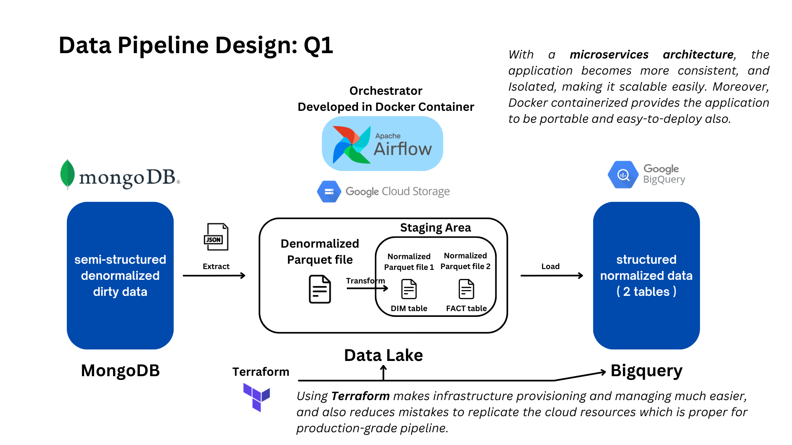
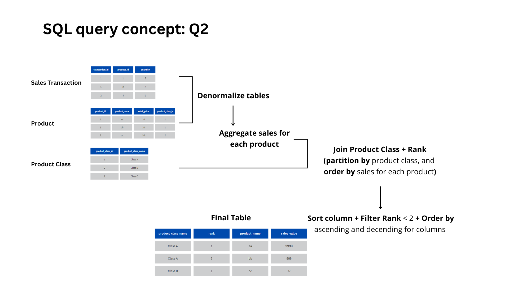

# TD Tech

by: Patcharanat P.

The answers are coresponding to the following questions:

## Question 1: Data Pipeline design

1. Setting up airflow containers, involving the following files:
    - [docker-compose.yml](./docker-compose.yml)
    - [Dockerfile](./Dockerfile)
    - [fernet_key_generator.py](./fernet_key_generator.py)
    - [fernet-key.txt](./fernet-key.txt)

2. Install dependencies
    - [requirements.txt](./requirements.txt)

3. Setting up GCP Infrastructure by Terraform
    - [main.tf](./terraform/main.tf)
    - [variables.tf](./terraform/variables.tf)

4. Setting up airflow DAGs
    - [ETL.py](./src/dags/ETL.py)

5. Data modeling for handling semi-structured demo data from MongoDB
    - [data_modeling.ipynb](./data_modeling.ipynb)



***Note1: To run the demo, please follow the steps below:***
1. Create a new cluster0 (free tier) in MongoDB Atlas and connect Network IP
2. Clone this repository
```bash
git clone https://github.com/Patcharanat/TD-test.git
```
3. Create `.env` file containing:
```
MONGODB_USERNAME    = your_mongodb_username
MONGODB_PASSWORD    = your_mongodb_password

# GCP resources
GOOGLE_APPLICATION_CREDENTIALS  = td_service_account.json
PROJECT_ID                      = your_project_id
GCP_BUCKET                      = your_test_gcp_bucket
DATASET_NAME                    = your_test_dataset_name
```
4. Create a new project in GCP
5. Create a new service account in GCP
6. Download the service account key as `td_service_account.json` and put it in the root directory
7. Add the following roles to the service account:
    - BigQuery Admin
    - BigQuery Data Editor
    - BigQuery Data Viewer
    - BigQuery Job User
    - BigQuery User
    - Storage Admin
    - Storage Object Admin
    - Storage Object Creator
    - Storage Object Viewer
8. Run the following commands:
```bash
terraform init

terraform plan

terraform apply

# wait for the terraform to finish

# can omit building images part
docker compose build

docker compose up -d

# wait for the airflow init to finish and airflow webserver to be ready

# go to `localhost:8080`

# trigger the DAG

# check data in gcs and bigquery

# when you're done with demo
docker compose down -v

# delete built images in docker desktop

terraform destroy
```

***Note2: debugging in pipeline development***

1. MongoDB
    - MongoDB timeout with `MongoServerSelectionError` needed to keep update my IP address in MongoDB Atlas Network Access after no longer using it for a while. 

2. Docker
    - Using airflow backend volumes without specify correctly at the last part of `.yml` file causing the container to restart continuously due to the error `airflow init db` error.
    - Airflow container need the google credentials and requirements.txt to be built first before running the container, so I have to extend the official airflow image additionally with [Dockerfile](./Dockerfile).
    - Using **"parquet"** file type need to install `pyarrow` library in the container, which can conflict with python version if the pulled image is not with the right python version.

3. Airflow (DAG script and UI)
    - This is the most frustated part for me, spending a lot of time debugging the DAG script via the UI. When it's about dependencies conflict, I have to rebuild the image and restart the container to get the right dependencies which is very time-consuming.
    - Trasforming the json data form MongoDB to parquet first then load it in other task cleaning it after, was causing a bug due to using `normalize_json` function with `to_dict` in `pandas` library. So, I transform the json data to parquet in the "extract" task and it works fine.
    - Forgetting to add `env_file` in `docker-compose.yml` causing the unavailability of environment variables in the container.

4. Terraform
    - When applying terraform, I found out service account doesn't have permission enough to create bucket, so I added the following role to the service account:
        - Storage Admin
    - Defining schema for data we intend to store in BigQuery is a hard work, then I found out that we can use `autodetect` option in BigQuery load job to automatically infer the schema from the data. This is a good practice for handling semi-structured data.
    - Instead of using `bigquery` module, using `google_bigquery_dataset` and `google_bigquery_table` resources are more convenient and simpler for me.


## Question 2: Text Sanitizer

The script written in [text_sanitizer.py](./src/dags/text_sanitizer.py) as OOP Python can be run by the following cli command:

```bash
# without arguments (plus user interactive input)
python text_sanitizer.py

# or with arguments
python text_sanitizer.py source.txt target.txt True
# input cli: python3 text_sanitizer.py source target write_out

# use this if run the script in the project root directory
python ./src/dags/text_sanitizer.py
```

Involving the following files:
- [text_sanitizer.py](./src/dags/text_sanitizer.py)
- [source.txt](./src/dags/source.txt) (for class testing)
- [target.txt](./src/dags/target.txt) (for class testing)

## Question 3: SQL

The SQL query is written in [sql_query.sql](./sql_query.sql)



---
Thanks for reading :)